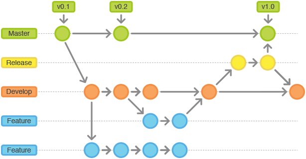
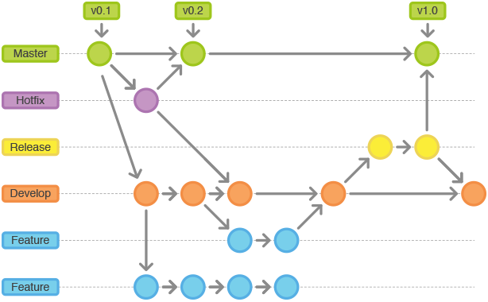

#### 常设分支：永久不删除

1. master：生产环境的稳定分支，构建生产环境
    - 仅用来发布新版本，除了从 release 测试分支或 hotfix-* Bug修复分支进行merge，不接受任何其它修改。
    - master分支上存放的应该是随时可供在生产环境中部署的代码
    - 每一次更新，最好添加对应的版本号标签。
2. develop：开发环境的稳定分支，公共开发环境基于该分支构建
    - develop分支来源于feature、release、hotfix-*分支。

#### 临时分支：用完立即删除

1. feature-* ：功能分支，是为了开发某个特定功能，从 develop 分支上面分出来的。开发完成后，要merge到 develop 分支。
    - 功能分支的命名，采用 feature-* 的形式命名( * 为任务单号)

2. release ：测试环境的稳定分支，本分支是从develop分支派生出来的
    - 测试人员在该分支进行测试并提交Bug,开发人员基于该分支派生的bugfix-*分支进行bug修复，最终再合并回release分支，待测试完成，该分支必须合并回develop分支和master分支。

3. bugfix-* ：测试阶段修复Bug用此类分支命名，该分支是为了修复某个bug，从 release 分支上面分出来的。修复完成后，再合并回 release 分支。
    - Bug修复分支的命名，采用 bugfix-* 的形式命名（*为bug单号）

4. hotfix-* ：线上出现的紧急Bug，需要及时修复用此类分支命名，从 master 分支切换出来的分支，修复之后合并回 master 和 develop 。

---

#### 正常开发流程

1. 从 develop 分支切出多个命名为 feature-*  分支开发新功能。

2. 开发者完成开发，提交分支到远程仓库。

3. 开发者发起merge请求（可在gitlab页面“New merge request”），将新分支请求merge到 develop 分支，并提醒code reviewer进行review

4. code reviewer对代码review之后，若无问题，则接受merge请求，新分支merge到 develop 分支，同时可删除新建分支；若有问题，则不能进行merge，可close该请求，同时通知开发者在新分支上进行相应调整。调整完后提交代码重复review流程。

5. 转测时，直接从当前 develop 分支merge到 release 分支，重新构建测试环境完成转测。

6. 测试完成后，从release分支merge到 master 分支，基于 master 分支构建生产环境完成上线。并对 master 分支打tag，tag名可为v1.0.0_2019032115（即版本号_上线时间）

#### 生产环境Bug修复流程

1. 非紧急Bug或优化 ：非关键业务流程问题，仅影响用户使用体验，或出现频率较小等，为非紧急Bug，可规划到后续版本进行修复 
    - 参考“正常开发流程” 
2. 紧急Bug ： 严重影响用户使用的为紧急Bug，需立即进行修复。如关键业务流程存在问题，影响用户正常的业务行为
    -  从 master 分支切出一个bug修复分支，完成之后需要同时merge到 master 分支与 develop 分支 
    -  如果需要测试介入验证，则可先merge到 release 分支，验证通过后再merge到 master 分支上线 

