#### 简单操作

1. 提交：git commit

2. 创建分支：git branch bugFix

3. 切换分支：git checkout bugFix

4. 创建并切换分支： git checkout -b bugFix 

5. 合并分支：

   - git merge bugFix，先切换到main分支，然后将bugFix合并过来
   - git rebase main，先切换到bugFix分支，然后rebase主分支到bugFix分支，这样bugFix的提交记录就都在main的之后了
   - git rebase main bugFix：不管当前HEAD是在哪都行，相当于先切换到bugFix分支，再进行与main分支合并

---

#### 一些特性

1. HEAD：

   - Git实际上维护的是一串历史记录，每个历史标号都是一条记录的id

   - 不同的分支表示不同的指针，指向某一个历史标号，沿着那个标号往前，可以查看所有的历史记录，每一个分支有自己的指针，例如main，bugFix

   - HEAD也是一个指针，只是我们经常情况下将其和分支指针指向同一个历史记录

   - git checkout bugFix：切换分支

      git checkout commitId：HEAD指针指向某一个提交记录

   使用场景：省却了建分支删分支的很多麻烦

   - 如果临时想基于某个commit做变更，试试新方案是否可行，就可以采用分离头指针的方式。测试后发现新方案不成熟，直接reset回其他分支即可，省去了建、删分支的麻烦，git会忽略管理这个没有分支commit
   - 进行到某个commit，试试新方案，为该commit建立新的branch，可以进行特性开发
   - 分离头指针对应的commit，你如果认为有用需要保留，那就用新分支把它保留
   - 如果当下无master分支，可以在分离头指针状态下，git checkout -b master HEAD

2. 相对引用：

   - git checkout commitId 这种方式不太方便，因为commitId会很长，当然可以提交commitId的前几个字符也可以完全匹配到
   - 使用相对引用，会从HEAD或者bugFix分支开始计算
     - 使用 ^ 向上移动 1 个提交记录，main^
     - 使用 ~ 向上移动多个提交记录，bugFix ~3，要是不加数字，默认向上 1 个

   使用场景：移动分支

   - git branch -f main HEAD~3：将main分支强制指向HEAD的前3次提交

3. 撤销变更：

   - git reset HEAD~1：（git reset commitId） 通过把分支记录回退几个提交记录来实现撤销改动。git reset 向上移动分支，原来指向的提交记录就跟从来没有提交过一样

   - 在reset后， 之前所做的变更还在，但是处于未加入暂存区状态
   
   - 虽然在你的本地分支中使用 git reset 很方便，但是这种“改写历史”的方法对大家一起使用的远程分支是无效的
   
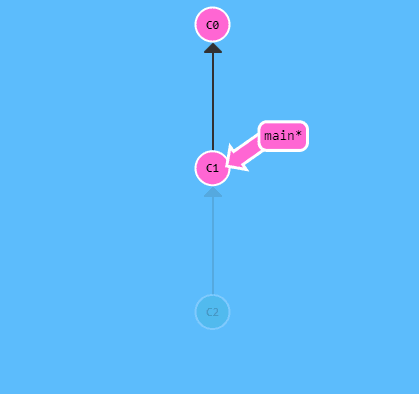

   - git revert HEAD~1：（git revert commitId）在我们要撤销的提交记录后面多了一个新提交
   
   - 新提交记录 `C2'` 引入了更改，刚好用来撤销 `C2` 这个提交。也就是说 `C2'` 的状态与 `C1` 是相同的
    
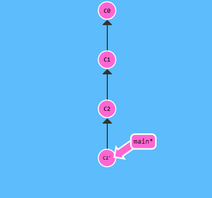

---

#### 自由修改提交树

1. git cherry-pick commitId：将一些提交复制到当前所在的位置（`HEAD`）下面

2. git rebase -i HEAD~1：交互式rebase，可以打开UI界面自由选择想要复制rebase的记录，并且随意选择部分删除部分排序等
   
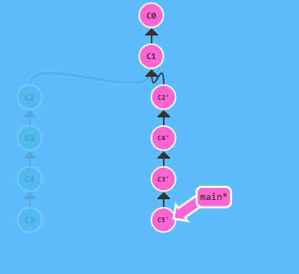

---

#### 技巧贴士集合

1. 只提取一个提交记录：开发中寻找bug时，会提交一些打印信息的记录，之后修复了bug，只提取修复bug的记录到主分支
   - git cherry-pick commitId：
   - git rebase -i HEAD：
   
2. 标签：

   - git tag v1 C1：（如果未指定C1，会默认HEAD位置）

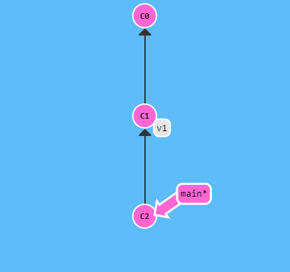

   - git describe ref：描述离你最近的标签引用

     < tag > _ < num > _ g< hash >：tag表示离ref最近的标签，num表示ref和tag相差几个记录，hash是ref的hash值前几位

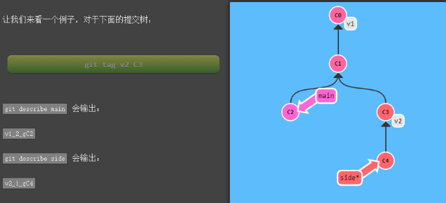

1. git checkout main：假设默认正上方的记录是第一个父记录

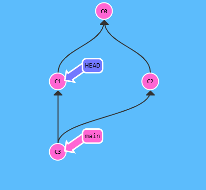

   git checkout main^2：假设默认正上方的记录是第一个父记录，会到另一个父记录

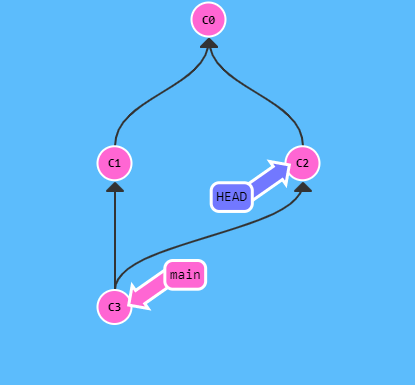
   
   git checkout HEAD ~ ^ 2 ~ 2：链式操作
   
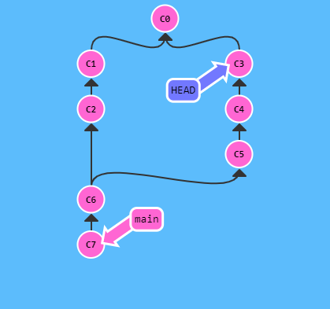

---

#### 远程仓库

1. git fetch：实际上将本地仓库中的远程分支更新成了远程仓库相应分支最新的状态 

   - 从远程仓库下载本地仓库中缺失的提交记录
   - 更新本地仓库中的远程分支指针（origin/main）
   - 不会改变你本地仓库的状态，不会更新你的（main）分支，也不会修改你磁盘上的文件 

2. git pull：git fetch + git merge origin/main

   git pull --rebase：git fetch + git rebase origin/main

3. git push：推送

---

#### 远程技巧

1. rebase： 仁者见仁，智者见智

   - 优点： 使你的提交树变得很干净, 所有的提交都在一条线上

   - 缺点： 修改了提交树的历史

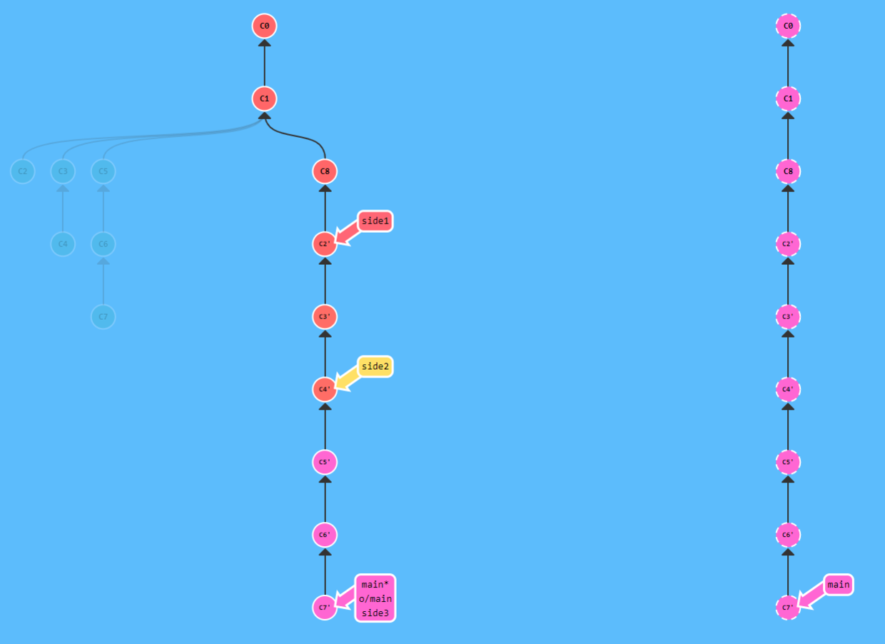

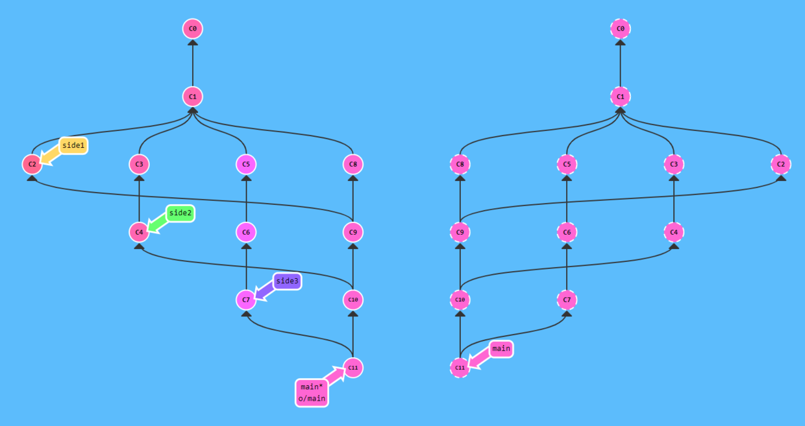

2. 远程跟踪： remote tracking

   - 当你克隆时, Git 会为远程仓库中的每个分支在本地仓库中创建一个远程分支（比如 o/main）。然后再创建一个跟踪远程仓库中活动分支的本地分支，默认情况下这个本地分支会被命名为 main。 

   -  main 和 o/main 的关联关系就是由分支的“remote tracking”属性决定的。main 被设定为跟踪 o/main —— 这意味着为 main 分支指定了推送的目的地以及拉取后合并的目标。 

   -  你可以让任意分支跟踪 o/main, 然后该分支会像 main 分支一样得到隐含的 push 目的地以及 merge 的目标。 这意味着你可以在分支 totallyNotMain 上执行 git push，将工作推送到远程仓库的 main 分支上。 

   - 有两种方法设置这个属性，第一种就是通过远程分支检出一个新的分支，执行:
     git checkout -b totallyNotMain o/main

     就可以创建一个名为 totallyNotMain 的分支，它跟踪远程分支 o/main。

   - 另一种设置远程追踪分支的方法就是使用：git branch -u 命令，执行：

     git branch -u o/main foo

     这样 foo就会跟踪 o/main 了。如果当前就在 foo 分支上, 还可以省略 foo：

     git branch -u o/main

3. git push < remote >  < place >： 

   - git push origin main 

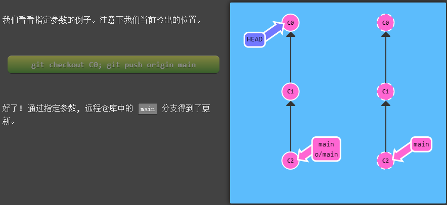

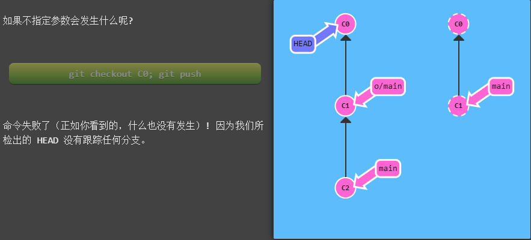
